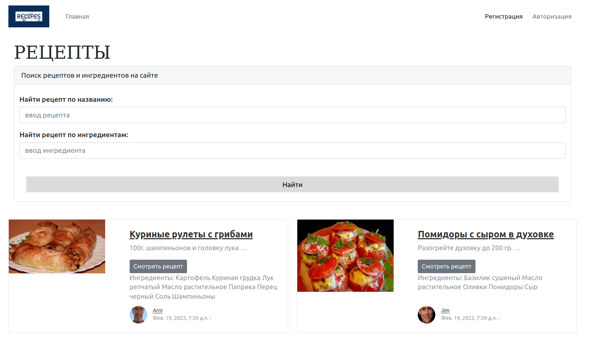

# Веб-сайт кулинарных пецептов.

## Функционал проекта

### Структура страницы сайта

В верхней части страницы находится **навигационная панель** с кликабельным логотипом сайта и ссылкой "Главная страница". 


Оба элемента переадресовывают пользователя на **главну страницу**. В верхней части которой реализован поиск рецептов по названию рецепта и по ингредиенту рецепта.



На **главной странице** расположены все рецепты с ингредиентами и с указаниями авторов данного рецепта. Чтобы перейти к описанию рецепта можно кликнуть на картинку рецепта, на название или на кнопку "Смотреть рецепт"
В нижней части сайта реализованиа постраничная пагинация


На **навигационной панели** зарегистрированный пользователь видит ссылку на добавление нового рецепта, строку приветствия с указанием своего никнейма и ссылку "Выход".


На странице с описанием рецепта пользователь видит автора рецепта, картинку рецепта, название, список ингредиентов и подробную интрукцию по приготовлению.


На **навигационной панели** с определенным рецептом зарегистрированный пользователь видит ссылки на редактирование и удаления рецепта. Проделать эти операции может только автор рецепта. Другой пользователь переадресуется на страницу с предупреждением. 


Незарегистрированный пользователь на **навигационной панели** видит ссылки "Регистрация" и "Авторизация". 


При успешной регистрации или авторизации появляется сообщение и происходит перенаправление на главную страницу


При ошибках выводится красное сообщение.


При переходе к профилю пользователя на экран выводится краткая информация о пользователе и список рецептов, которые он ввел.


### Структура проекта

Проект состоит из двух приложений apps: recipes и users, а также файлы конфигурации conf проекта. Приложение recipes имеет две модели: Recipe и Ingredient, связанных между собой отношением многие-ко-многим. Так же модель Recipe, приложения recipes связана отношением один-ко-многим с моделью User, приложения user.

В приложении recipes реализована логика CRUD для рецептов.
В приложении users реализована регистрация и авторизация пользователей.

#### Фреймворк: Django 3.2.8, сервер баз данных: PostgreSQL 14, СУБД и веб-приложение запускаются в отдельных Docker-контейнерах.

### Настройка проекта

Создайте `.env` файл в корне репозитория:

```bash
cp .env.conf .env
```

Внесите при необходимости корректировки в переменные окружения.

### Сборка образов и запуск контейнеров

В корне репозитория выполните команду:

```bash
docker-compose up --build
```

### Остановка контейнеров

Для остановки контейнеров выполните команду:

```bash
docker-compose stop
```

### Инициализация проекта

Для входа внутрь контейнера приложения выполните команду:

```bash
docker-compose exec app bash
```

***Команды выполняются внутри контейнера приложения:***

#### Создание миграций

```bash
python manage.py makemigrations
```

#### Применение миграций

```bash
python manage.py migrate
```

#### Добавление фикстур (для наполнения сайта начальными данными)

```bash
python manage.py loaddata initial_data
```

#### Сборка статики

```bash
python manage.py collectstatic
```

#### Создание суперпользователя

```bash
python manage.py createsuperuser
```

***Проект доступен по адресу http://0.0.0.0:8000***

#### Данные пользователей из фикстур

Jim: 
login: Jim, pass: Jim1q2w3e

Arni: 
login: Arni, pass: Arni1q2w3e